# My Personal Portfolio

### Version
1.1.2

### License
Copyright &copy; 2024 Shehan Rathnayake. All Rights Reserved. 
This project is licensed under [MIT License](License.txt)

## Sample Images

### Desktop View

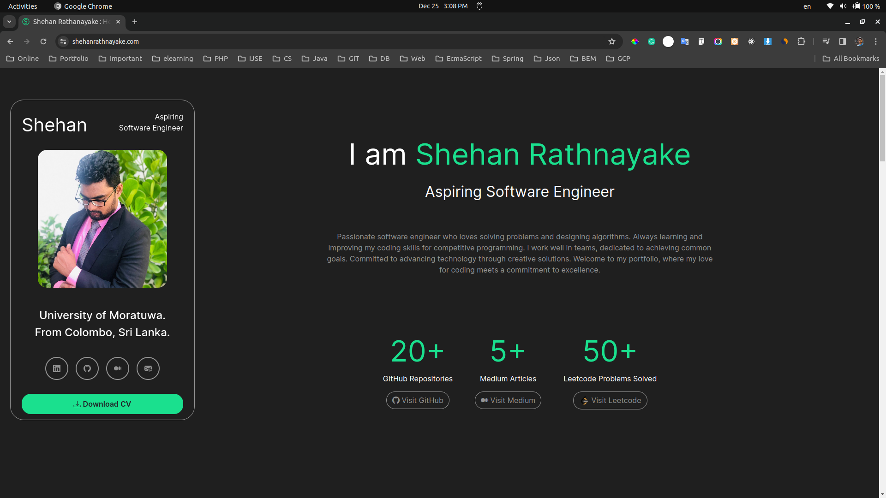 

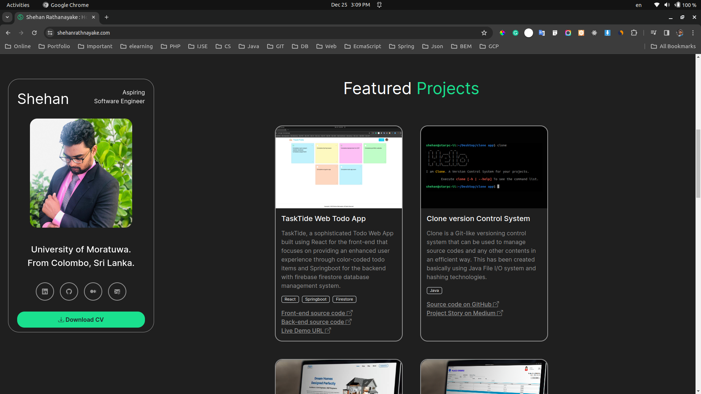 

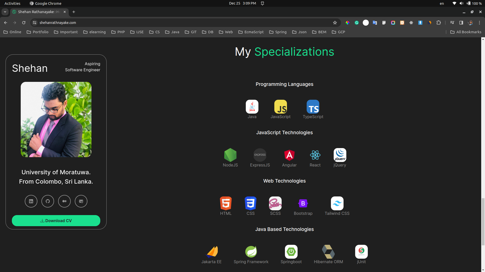 

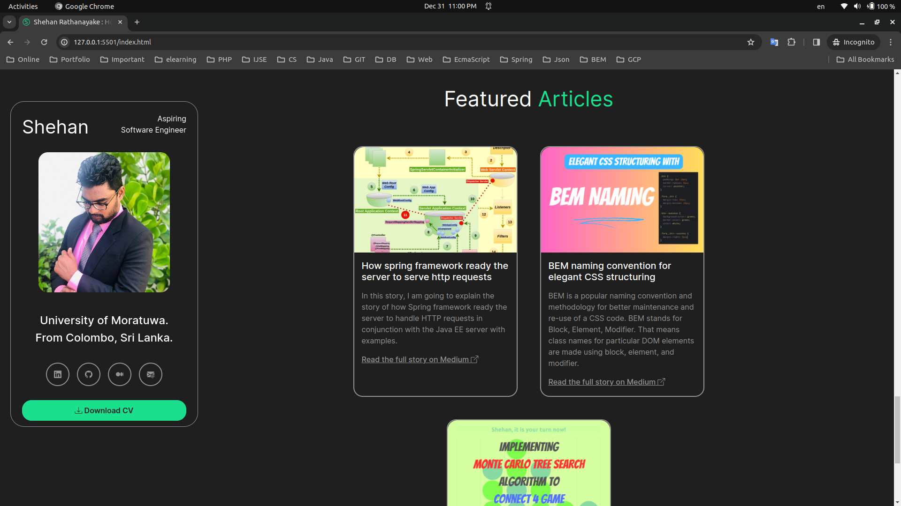 

### Mobile View

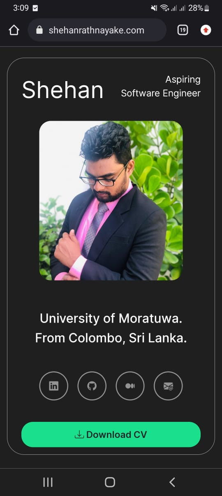

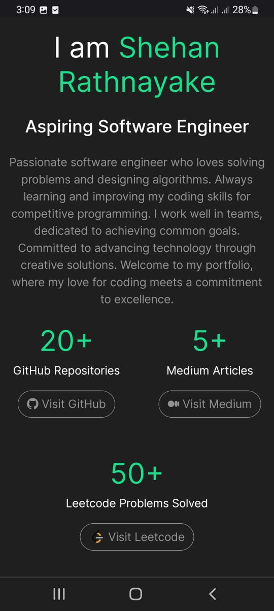

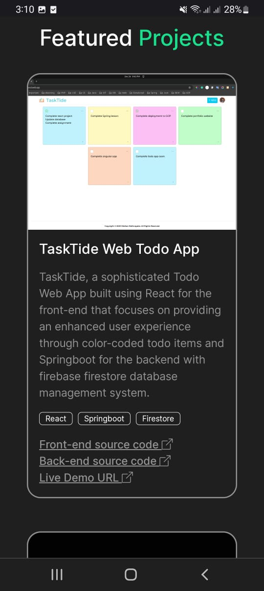

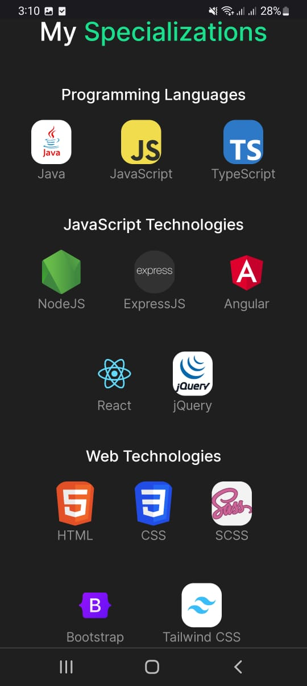

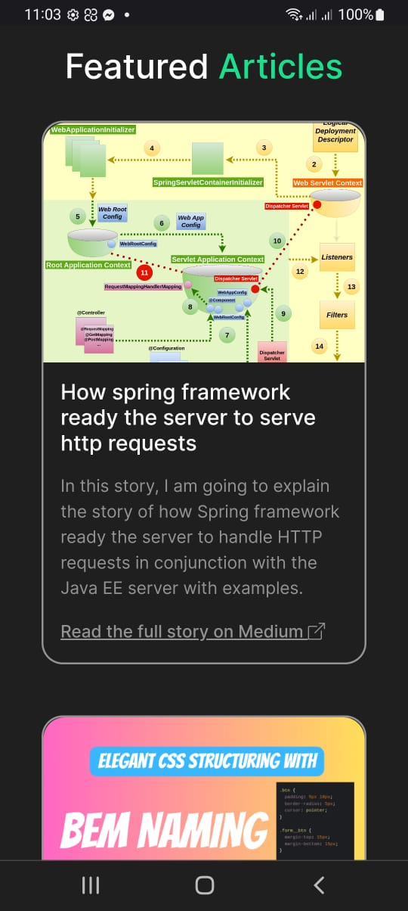

### Services

- Connected to Google Analytics

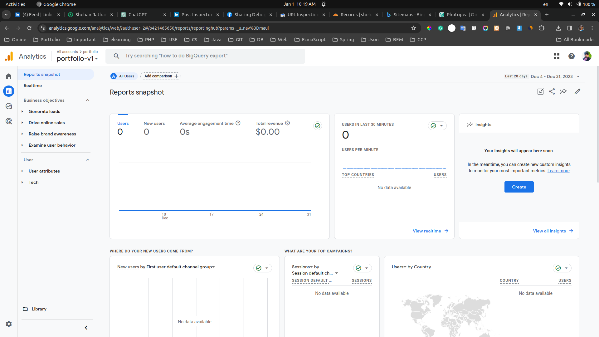 

- Connected Cloudflare CDN Service

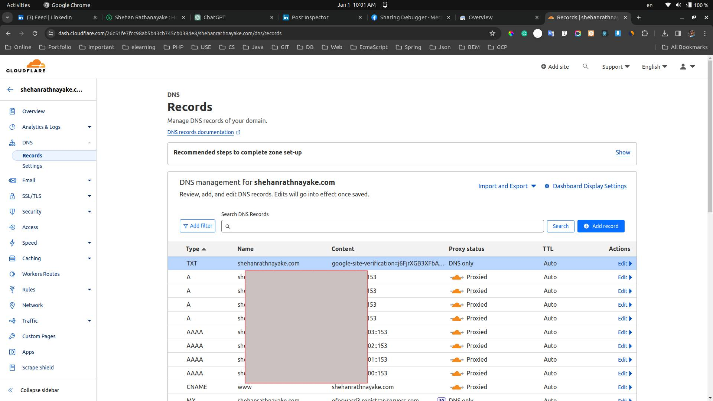 

- Submitted the sitemap to Google Search Console for indexing

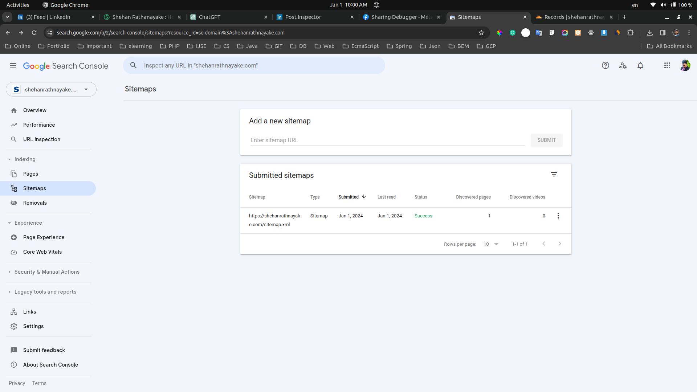 

- Submitted the sitemap to Bing Web Master for indexing

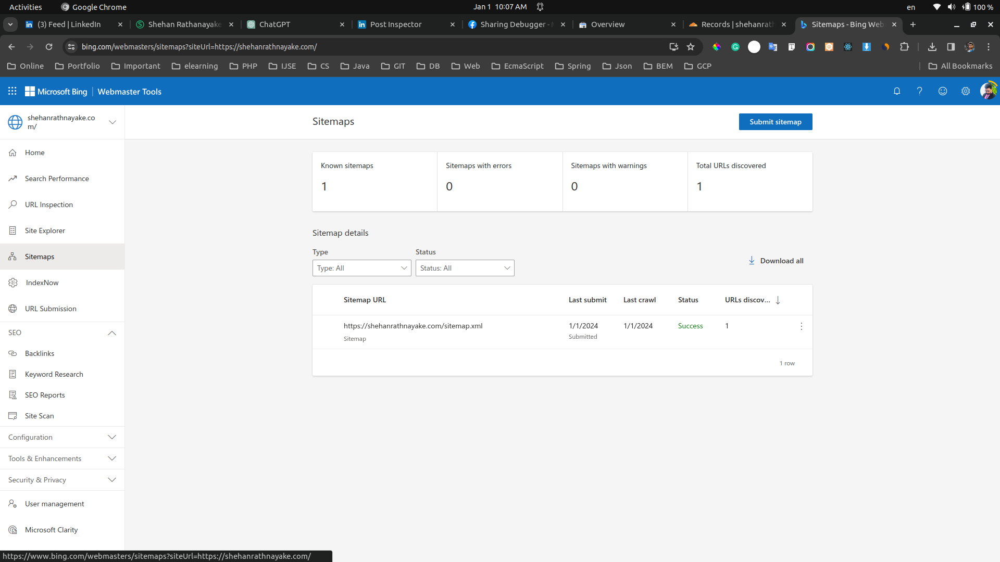 

- Set Open-Graph and Twitter Meta Tags

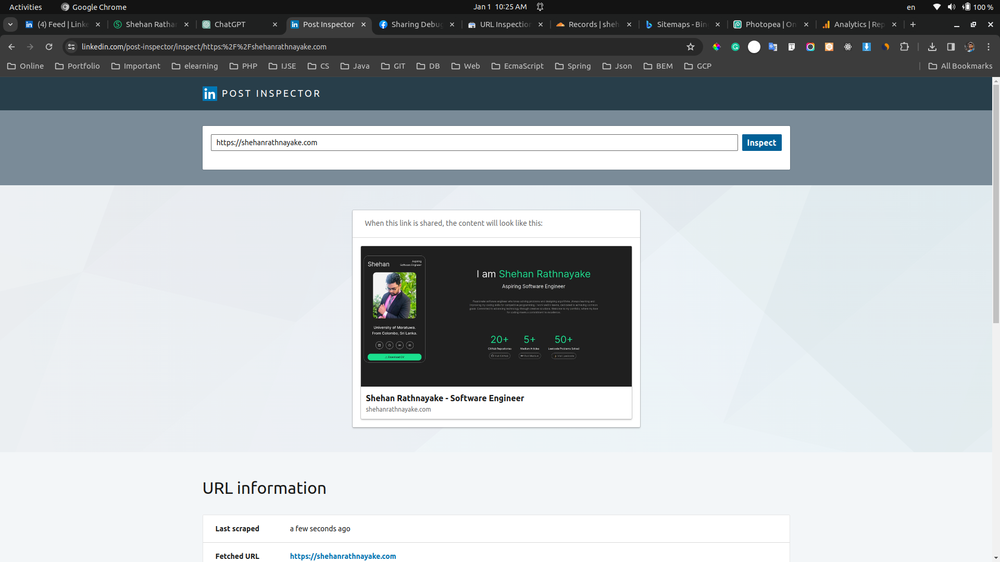 

### Support

***If you like what I do, maybe consider buying me a coffee*** 🥺 👇

  